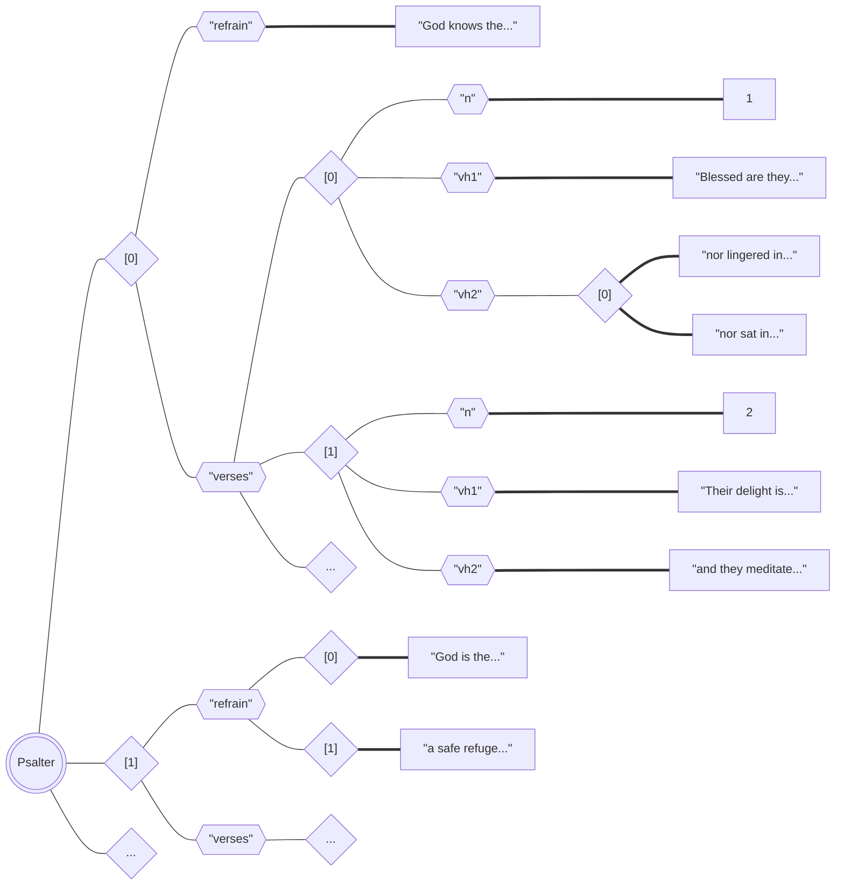
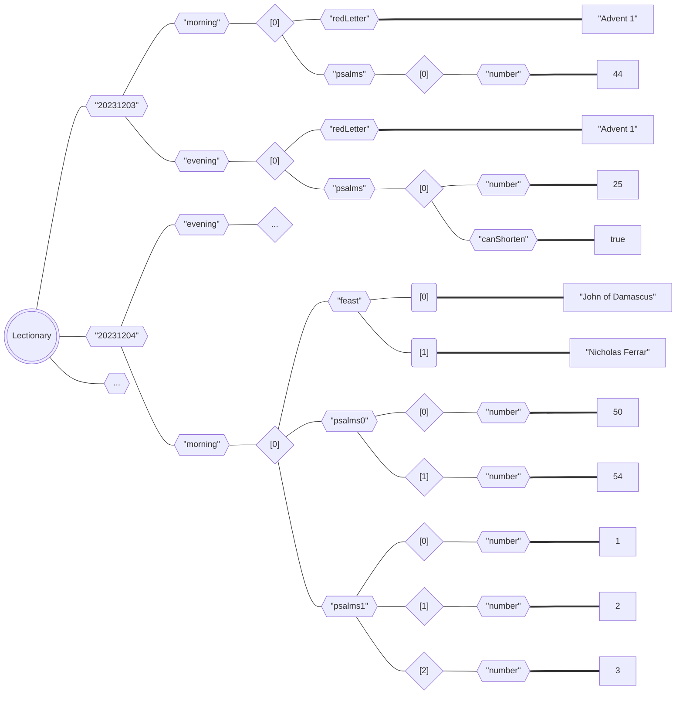

# OpenPsalter

#### Video Demo:  <URL HERE>

## Introducing the project
 
Hello! My name is Vienna, and I am a priest in the Episcopal Church, originally ordained in the Church of England.

*For definitions of certain words used throughout this README, see the [Glossary](#glossary).*

### Context

A lot of Christian prayers are taken from the Bible, which was written originally in Hebrew and Greek, and have been 
translated into modern languages. **There is no such thing as a neutral or unbiased translation -- every word is a 
choice**.

English translations tend to follow conventions, one of which concerns the gender of God. Although Christians do not 
believe that God is inherently male, God is usually described using masculine language and given masculine pronouns.

This is at least in part because the masculine in English has traditionally been used as a neutral option. But 
modern English vernacular commonly uses "they" for a subject with an unknown gender, and it is also 
inccreasingly becoming an accepted option for non-binary individuals. 

Theological conventions are sticky, though, and they don't often change with the times.

### The (admittedly niche) problem

My project is designed to solve a problem experienced by progressive/liberal Christians who regularly use prayers from 
the Bible known as [psalms](#psalm).

The psalms are written in personal language that encourages the reader to identify with the prayers written. But 
while many progressive Christians now try to use gender-neutral language about God, **the psalms are full of masculine 
language about God**.

Take, for example, the beginning of Psalm 23:1-2:
> The **Lord** is my shepherd; I shall not want. **He** makes me lie down in green pastures; **he** leads me beside 
> still waters.

Psalms are prayed every day by many Christians in something called the [Daily Office](#daily-office). If the reader 
doesn't tend to use gendered terms for God, this language is jarring.

### How to respond to the problem

I could have created a new translation that simply replaces the terms with alternatives, as some others have done. 
But **every word in translation is a choice**.

For example, with pronouns referring to God:
1. "God" could simply be used, as it is short enough not to interrupt the flow of the sentence. But this can 
   sometimes lead to phrases sounding awkward.
2. "they/them" could be used, as is conventional in modern English with an unknown subject. But some people are not 
   yet comfortable using that language with a *known* subject.

Given that the psalms are presented as personal prayers, an ideal solution would allow people to use language that 
didn't feel alien to them. That would mean different things for different people.

### OpenPsalter: a JavaScript-based solution

Learning about JavaScript presented me with a new option to address the problem: **a dynamic website that would 
programmatically adjust the language based on selected preferences**.

If I created some base text for the psalms with HTML elements containing certain words and phrases, I could create a 
code that would change the content of these elements according to choices set by the user.

This would be linguistically complicated, as changing words in a sentence often changes words around them -- for 
example, "he is" could become either "God is" or "they *are*". I would need to set up the text correctly and use 
objects to present each set of replacements.

I could then present the texts on a website that would allow these psalms to be read and used in the Daily Office, 
presented primarily for mobile. I decided to call the website **OpenPsalter**, as a psalter is a collection of psalms 
used in liturgy.

### An actually usable psalter

For this to work in practice, I identifiedy certain design priorities:

- **An easy way to select options:** preferences are set by interacting with a modal that can be generated on any page
- **Selected options persisting across sessions:** for simplicity and privacy, preferences are assigned to 
  `localStorage` variables.
- **Each psalm accessible individually:** each psalm can be viewed as a whole, and relevant information is stored in 
  URL parameters so that it can be bookmarked or shared.
- **Multiple and/or partial psalms on one page:** the psalm texts are split line-by-line and stored in a JSON, so 
  that when viewing the psalms for a given [office](#daily-office), scripts can retrieve only the sections that are 
  needed.

I also wanted to make sure that the site was accessible, and so I selected a font for reading that has been designed 
with people with dyslexia in mind. (Late in the process, I learnt about contrast accessibility and realised that my 
colour scheme does not meet accessibility standards -- this is something I will update as a priority.)

## Design choices

### Device priority

Following advice I found repeated several times online, I designed the website firstly so that it would function
well on mobile, and then scaled up using breakpoints (the values of which I took from Bootstrap). I ended up
reworking the index page significantly to be more useable on a larger screen, including a search box to allow for direct
navigation to any given psalm.

### Website structure

I initially created Open Psalter a single-page application, with different pages visited by showing and hiding
different elements on the page. I liked how quickly this loaded, mostly because I mostly because it only required 
fetching the JSON data for the psalm texts once.

However, friends who tested the site for me found that they would press the back button on the browser within the
application and unintentionally leave the website. As the website is currently designed to be used in browser rather
than as a standalone app, I converted the application to have several pages.

### Custom elements

Custom elements allowed me to create responsive elements that took input (in the form of attributes) and then
executed scripts accordingly.

This was especially helpful when developing the lectionary, which would need to generate anywhere between 1 and 3
psalm elements for a given day. I could simply write a code to create the correct number of elements, and
then pass them the psalm (and verses) to fetch from the psalter by assigning the relevant attributes.

## Languages and tools used

I have access to **Intellij IDEA** and so I used it to become familiar with an IDE. I did not use any of its LLM-powered
code generation.

I used **Python** to create the data objects from source materials. To process the texts, I often used **RegEx**, 
either in the code or in the IDE itself.

The website would obviously use **HTML** and be heavily dependent on **JavaScript**, which I wanted to learn. I 
also wanted to become comfortable with **CSS**, particularly its newer features. I therefore opted *not* to use a 
library like Bootstrap, and instead to build my website from scratch.

I am aware that much of the code I wrote is not efficient, and its results could have been achieved more 
straightforwardly had I used something like Bootstrap. But I feel that I have become much more comfortable with both 
JavaScript and CSS (and eventually **Sass**) than would otherwise be the case.

### Tools and learning resources

#### General

- [MDN web docs](https://developer.mozilla.org/en-US/docs/Web/)
- [W3 Schools](https://www.w3schools.com/)
- [RegExr](https://regexr.com/)

#### CSS/Sass

- [Modern CSS Solutions](https://moderncss.dev/)
- [Smol CSS](https://smolcss.dev/)
- [CSS-tricks](https://css-tricks.com/)
- [Sass Basics](https://sass-lang.com/guide/)

#### JavaScript

- [W3 Schools JavaScript resources and tutorials](https://www.w3schools.com/js)
- [JavaScript.info](https://javascript.info/)
- [The Odin Project JavaScript Basics](https://www.theodinproject.com/paths/foundations/courses/foundations#javascript-basics)

#### Problem solving

When addressing bugs or having difficulty approaching a problem, I generally tried these in order:

1. Google the problem, look at results from StackExchange
2. Look at Google results from other websites
3. Search the relevant docs
4. Ask ChatGPT for advice (see next section)

#### ChatGPT

I used ChatGPT as a learning tool, although I have not ended up with any code written by ChatGPT in my project.

I asked it to explain concepts, analyse my code, and help me understand unexpected consequences of my code. I 
always asked it not to write any code for me, and when it didn't comply I didn't use the code it generated.

When I was starting out with JavaScript, much of my code was not too dissimilar to what I might have written in C. I 
started feeding code I had written to ChatGPT, and asking whether whether it could be optimised or simplified. For 
example, ChatGPT suggested replacing a long set of `if ... else` statements with the ternary operator, which I then 
looked up and learnt about.

## Project code

### Python script to create the psalter data file
Path: `src/data/sources/create_psalter.py`

The text of the [psalter](#psalter) is a work in progress, and is contained in a markdown file for easy editing: 
`current_psalter.md`. I therefore knew that I wanted to be able to update OpenPsalter without needing to delve into 
the website code every time.

I therefore created a Python script, `create_psalter.py`, which:
1. Takes the markdown file as input and reads the text
2. Splits the text file into individual [psalms](#psalm)
3. Processes each psalm in turn to populate a dictionary
4. Outputs this dictionary as a JSON,`psalter.json`, which I move to the parent directory upon verification

The resulting JSON contains an array of 150 objects, one for each psalm in the [psalter](#psalter). It follows 
this structure to allow for individual psalms and [verses](#verse) -- and indeed lines within verses -- to be 
accessed on demand:

### Python script to create the lectionary data file
Path: `src/data/sources/create_lectionary.py`

The data containing details about which psalms are set on each day of the church year is contained in what is called 
a [lectionary](#lectionary). A new lectionary is provided every year, and I obtain it in the form of a `.ics` file 
from [almanac.oremus.org](https://almanac.oremus.org). (The most recent example is found in `almanac-2024.ics`).

Similarly to the psalter, I wanted to write a Python code that would create a JSON containing this data -- 
especially as I didn't want to have to create it manually every year (the current one is 12,471 lines long!).

However, as I do not maintain the source file for the lectionary myself, I cannot regularise its contents, and its 
information is not always presented consistently. I would need to account for different formatting possibilities and 
make sure that only the relevant characters are inputted into a dictionary for export.

I therefore wrote `create_lectionary.py`, which:
1. Takes the calendar file as input and reads the text
2. Splits the text file into individual days and removes as much extraneous data as possible
3. Processes each date in turn, either 
    - adding it to a dictionary organised by date and [office](#daily-office), or 
    - if the data cannot be added automatically due to complexity, adding it to a separate structure
4. Outputs the main dictionary as a JSON,`lectionary.json`
5. Also outputs a separate JSON containing days that could not be processed automatically, `manual_entry.json`

I then incorporte the data that could not be added programmatically into `lectionary.json`, and move the file into 
its parent directory.

### JavaScript objects containing language preference options
Path: `src/data/preferences.js`

This script exports objects containing the data for the options available to be chosen.

As this is static and is relatively small, I decided to implement it this way instead of as a JSON. It means it can 
be accessed without relying on asynchronicity through the `fetch()` API.

### HTML files

The main directory contains pages for each of the three sections of my website.

#### Index page:
Path: `index.html`

`index.html` contains a landing page, which welcomes people to the website and provides navigation to other sections.
It comes in several responsive variants that fit into two main categories, optimised for smaller and larger screens.

#### Psalter page
Path: `psalter.html`

The [psalter](#psalter) page contains the barebones of the page that loads when you access a specific [psalm](#psalm).

It contains the custom element `<psalm-card>` which, when an attribute is changed, will change its contents to 
reflect the content of the attributes:

- Setting the `number` attribute will change the psalm to the specified number (N.B. this value is *not* zero-based 
  indexed, as it refers to an actual psalm number).
- Setting the `section` attribute will change the psalm to the specified section  (N.B. this value *is* zero-based 
  indexed) of the specified psalm. It will also create a navigation bar which allows for navigation to different 
  sections within the psalm.

#### Lectionary page
Path: `lectionary.html`

The [lectionary](#lectionary) page contains the barebones of the page that loads when you request either Morning or 
Evening Prayer.

It contains the custom element `<office-container>`which, when an attribute is changed, will change its contents to 
reflect the content of the attributes:

- Setting the `day` attribute will load the set [psalms](#psalm) for the [office](#daily-office) that has been 
  requested, including as many `<psalm-card>` elements as is required.
- Setting the `psalm-set` attribute will change to the specified alternative set of psalms, if an alternative is 
  provided.

### Scripts
Path: `src/scripts`

This directory contains all the JavaScript code I wrote in order to make the website function.

As I learnt JavaScript in the process of creating this project, the files are not structured particularly logically 
or efficiently. If I were to rework the project, I would prioritise updating this directory. In particular, I am 
aware that some scripts are made redundant by others, and many could be optimised using techniques I learnt later in 
the process. But as the website functions as desired, I have left it as is for now.

- `helpers.js` contains scripts that are used throughout the project to simplify my code.
- `lectionary.js` contains scripts that run on the `lectionary.html` page to show the correct [psalms](#psalm) 
  according to the [lectionary](#lectionary), mostly via the `<office-container>` custom element. They also style 
  the page and enable interactive elements.
- `load.js` contains scripts to run on page load.
- `main.js` contains scripts that run on the `index.html` page to enable interactive elements.
- `modal.js` contains scripts that generate a modal, populate it and show it under certain circumstances. It refers 
  to a custom `<modal-card>` element that exists on all pages, and which loads the relevant content when connected 
  to the DOM.
- `prefs.js` contains scripts that implement preferences options in psalm texts.
- `psalm.js` contains scripts related to the `<psalm-card>` custom element, and is utilised on both `psalter.html` 
  and `lectionary.html`.
- `psalter.js` contains scripts that run on the `psalter.html` page to style the page and enable interactive elements.
- `ui.js` contains scripts that alter the UI on several pages.

### Styles
Path: `src/styles`

This directory contains two child directories:

- `scss`, which contains Sass files for my project (formatted as SCSS)
- `css` which contains the output from the SCSS preprocessor

As my project grew, I had three different sections to style, and much of the interactivity of the UI was 
implemented through CSS transitions. My stylesheet was unwieldy and difficult to navigate. I tried to split my styles 
into separate sheets that I imported separately onto relevant pages, but this slowed my page load and lead to 
unintentional code repetition. I therefore decided to learn how to implement Sass, and restructured the stylesheets 
accordingly.

Sass also allowed me to implement some helpful features, like mixins and constant variables (as opposed to native 
CSS variables which I still used when they might need to be used dynamically).

## Glossary

*This terminology is explained from an Episcopalian Christian perspective. Other Christian viewpoints and Jewish 
perspectives will differ significantly.*

#### psalm

A kind of prayer found in the book of Psalms in the Bible. There are 150 of them, and they are used in daily prayer 
by Christians of many different denominations.

#### verse

An individual line within a psalm.

#### psalter

A book containing the psalms, often laid out to facilitate their use in prayer and liturgy.

#### lectionary

A table containing readings (including psalms) that are set to be read each day, so that people in different places 
can follow a united pattern of prayer.

#### daily office

*or “the office” for short*

A form of daily prayer that includes, amongst other things, recitation of the psalms. It comes in several variants 
depending on the time of the day. OpenPsalter provides psalms for two offices: Morning Prayer and Evening Prayer.